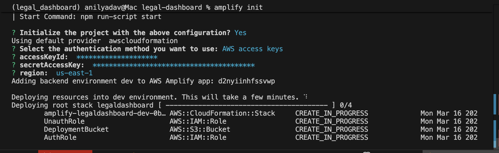
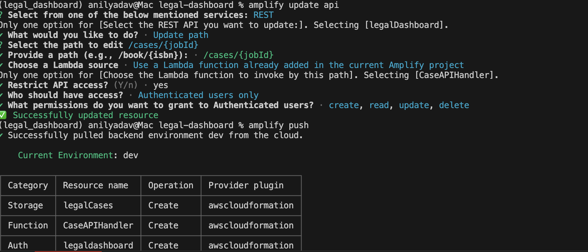
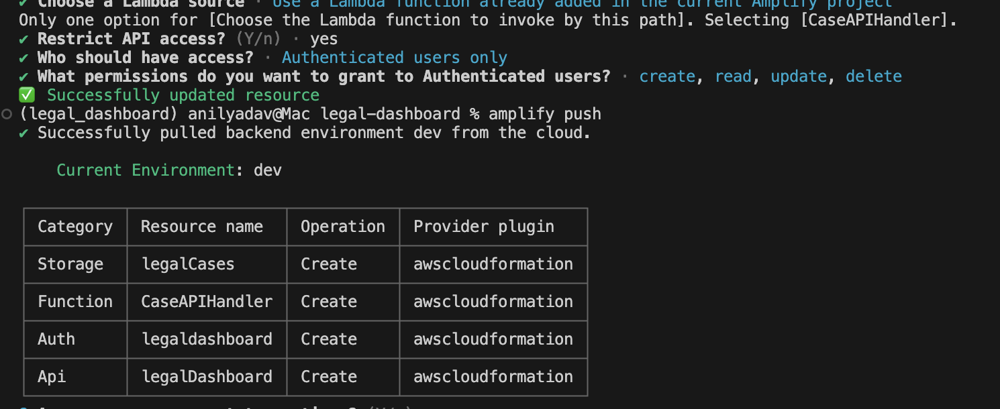

# ⚖️ AI DRIVEN LEGAL SYSTEM
An end-to-end AI-powered legal intake system that automates document processing, extracts structured case data, and generates actionable insights for legal workflows.

---

## 🚀 Overview

AI Driven Legal System automates the intake of legal documents (like police accident reports) by:

- 📩 Receiving emails via AWS SES  
- 📄 Extracting PDFs from emails  
- 🔍 Processing documents using AWS Textract  
- 🧠 Extracting structured legal data using Amazon Bedrock (LLM)  
- 💾 Storing results in DynamoDB  
- 📧 Sending automated client emails  
- 📊 Visualizing case data in a React dashboard  

---

## 🧠 Key Features

- ✅ Automated email-to-case pipeline  
- ✅ AI-based legal data extraction (Bedrock)  
- ✅ Smart client identification (driver / pedestrian / bicyclist)  
- ✅ Vehicle damage visualization  
- ✅ Human vs Vehicle detection in UI  
- ✅ Retainer email automation via SES  
- ✅ Serverless architecture (AWS Lambda + Step Functions)

---

## 🏗️ Architecture

